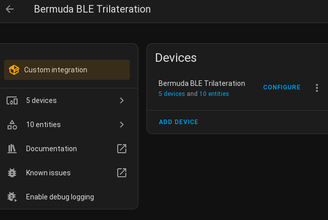
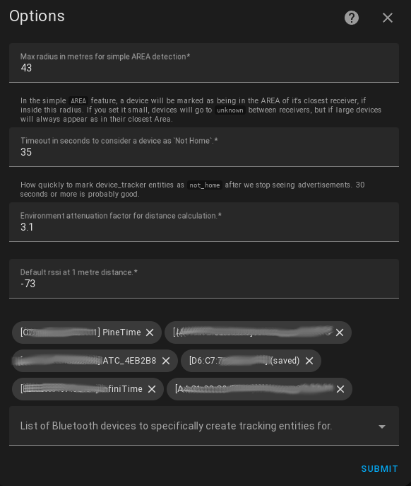
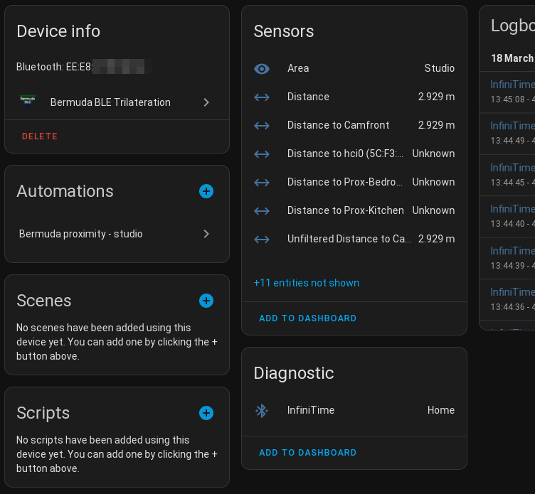
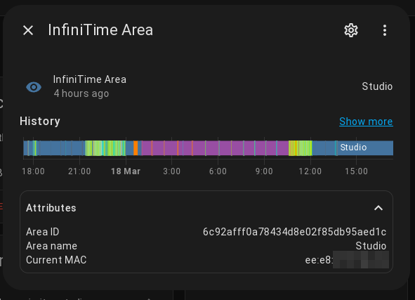
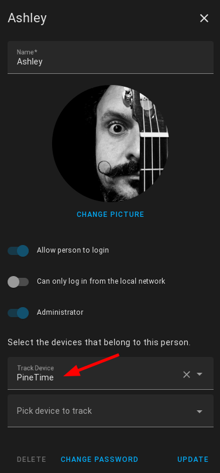

# Bermuda BLE Trilateration

- Track bluetooth devices by Area (Room) in [Home Assistant](https://home-assistant.io/), using [ESPHome](https://esphome.io/) [Bluetooth Proxies](https://esphome.io/components/bluetooth_proxy.html) and Shelly Gen2 or later devices.

- (eventually) Triangulate device positions! Like, on a map. Maybe.

[![GitHub Release][releases-shield]][releases]
[![GitHub Activity][commits-shield]][commits]
[![License][license-shield]](LICENSE)
[![HomeAssistant Minimum Version][haminverbadge]][haminver]
[![pre-commit][pre-commit-shield]][pre-commit]
[![Black][black-shield]][black]
[![hacs][hacsbadge]][hacs]
[![Project Maintenance][maintenance-shield]][user_profile]
[![Discord][discord-shield]][discord]
[![Community Forum][forum-shield]][forum]

[![GitHub Sponsors][sponsorsbadge]][sponsors]
[![BuyMeCoffee][buymecoffeebadge]][buymecoffee]
[![Patreon Sponsorship][patreonbadge]][patreon]

## What it does:

Bermuda aims to let you track any bluetooth device, and have Home Assistant tell you where in your house that device is. The only extra hardware you need are esp32 devices running esphome that act as bluetooth proxies. Alternatively, Shelly Plus devices can also perform this function.

- Area-based device location (ie, device-level room prescence) is working reasonably well.
- Creates sensors for Area and Distance for devices you choose
- Supports iBeacon devices, including those with randomised MAC addresses (like Android phones running HA Companion App)
- Supports IRK (resolvable keys) via the [Private BLE Device](https://www.home-assistant.io/integrations/private_ble_device/) core component. Once your iOS device (or Android!) is set up in Private BLE Device, it will automatically receive Bermuda sensors as well!
- Creates `device_tracker` entities for chosen devices, which can be linked to "Person"s for Home/Not Home tracking
- Configurable settings for rssi reference level, environmental attenuation, max tracking radius
- Provides a comprehensive json/yaml dump of devices and their distances from each bluetooth
  receiver, via the `bermuda.dump_devices` service.

## What you need:

- Home Assistant. The current release of Bermuda requires at least ![haminverbadge]
- One or more devices providing bluetooth proxy information to HA using HA's bluetooth backend. These can be:
  - ESPHome devices with the `bluetooth_proxy` component enabled. I like the D1-Mini32 boards because they're cheap and easy to deploy.
  - Shelly Plus or later devices with Bluetooth proxying enabled in the Shelly integration.
  - USB Bluetooth on your HA host. This is not ideal, since they do not timestamp the advertisement packets and finding a well-supported usb bluetooth adaptor is non-trivial. However they can be used for simple "Home/Not Home" tracking, and basic Area distance support is enabled currently.

- Some bluetooth BLE devices you want to track. Phones, smart watches, beacon tiles, thermometers etc.

- Bermuda! I strongly recommend installing Bermuda via HACS:
  

## Documentation and help

[The Wiki](https://github.com/agittins/bermuda/wiki/) is the primary and official source of information for setting up Bermuda.

[Discussions](https://github.com/agittins/bermuda/discussions/) contain both official and user-contributed guides, how-tos and general Q&A.

[HA Community Thread for Bermuda](https://community.home-assistant.io/t/bermuda-bluetooth-ble-room-presence-and-tracking-custom-integration/625780/1) contains a *wealth* of information from and for users of Bermuda, and is where many folk first ask for assistance in setting up.

## Screenshots

After installing, the integration should be visible in Settings, Devices & Services

Press the `CONFIGURE` button to see the configuration dialog. At the bottom is a field
where you can enter/list any bluetooth devices the system can see. Choosing devices
will add them to the configured devices list and creating sensor entities for them. See [How Do The Settings Work?](#how-do-the-settings-work) for more info.

Choosing the device screen shows the current sensors and other info. Note that there are extra sensors in the "not shown" section that are disabled by default (the screenshot shows several of these enabled already). You can edit the properties of these to enable them for more detailed data on your device locations. This is primarily intended for troubleshooting or development, though.

The sensor information also includes attributes area name and id, relevant MAC addresses
etc.

In Settings, People, you can define any Bermuda device to track home/away status
for any person/user.

## FAQ

See [The FAQ](https://github.com/agittins/bermuda/wiki/FAQ) in the Wiki!

## Hacking tips

Wanna improve this? Awesome! Bear in mind this is my first ever HA
integration, and I'm much more greybeard sysadmin than programmer, so ~~if~~where
I'm doing stupid things I really would welcome some improvements!

You can start by using the service `bermuda.dump_devices` to examine the
internal state.

### Using `bermuda.dump_devices` service

Just calling the service `bermuda.dump_devices` will give you a full dump of the internal
data structures that bermuda uses to track and calculate its state. This can be helpful
for working out what's going on and troubleshooting, or to use if you have a very custom
need that you can solve with template sensors etc.

If called with no parameters, the service will return all data. parameters are available
which let you limit or reformat the resulting data to make it easier to work with. In particular
the `addresses` parameter is helpful to only return data relevant for one or more MAC addresses
(or iBeacon UUIDs).
See the information on parameters in the `Services` page in Home Assistant, under `Developer Tools`.

Important: If you decide to use the results of this call for your own templates etc, bear in mind that
the format might change in any release, and won't necessarily be considered a "breaking change".
This is beacuse the structure is used internally, rather than being a published API. That said, efforts will be made
to indicate in the release notes if fields in the structure are renamed or moved, but not for adding new
items.

## Prior Art

The `bluetooth_tracker` and `ble_tracker` integrations are only built to give a "home/not home"
determination, and don't do "Area" based location. (nb: "Zones" are places outside the
home, while "Areas" are rooms/areas inside the home). I wanted to be free to experiment with
this in ways that might not suit core, but hopefully at least some of this could find
a home in the core codebase one day.

The "monitor" script uses standalone Pi's to gather bluetooth data and then pumps it into
MQTT. It doesn't use the `bluetooth_proxy` capabilities which I feel are the future of
home bluetooth networking (well, it is for my home, anyway!).

ESPresense looks cool, but I don't want to dedicate my nodes to non-esphome use, and again
it doesn't leverage the bluetooth proxy features now in HA. I am probably reinventing
a fair amount of ESPresense's wheel.

## Installation

You can install Bermuda by opening HACS on your Home Assistant instance and searching for "Bermuda".
Alternatively you can click the button below to be automatically redirected.

You should now be able to add the `Bermuda BLE Trilateration` integration. Once you have done that,
you need to restart Home Assistant, then in `Settings`, `Devices & Services` choose `Add Integration`
and search for `Bermuda BLE Trilateration`. It's possible that it will autodetect for you just by
noticing nearby bluetooth devices.

Once the integration is added, you need to set up your devices by clicking `Configure` in `Devices and Services`,
`Bermuda BLE Trilateration`.

In the `Configuration` dialog, you can choose which bluetooth devices you would like the integration to track.

You can manually install Bermuda by doing the following:

1. Using the tool of choice open the directory (folder) for your HA configuration (where you find `configuration.yaml`).
2. If you do not have a `custom_components` directory (folder) there, you need to create it.
3. In the `custom_components` directory (folder) create a new folder called `bermuda`.
4. Download _all_ the files from the `custom_components/bermuda/` directory (folder) in this repository.
5. Place the files you downloaded in the new directory (folder) you created.
6. Restart Home Assistant
7. In the HA UI go to "Configuration" -> "Integrations" click "+" and search for "Bermuda BLE Trilateration"

<!---->

## Contributions are welcome!

If you want to contribute to this please read the [Contribution guidelines](CONTRIBUTING.md)

## Credits

This project was generated from [@oncleben31](https://github.com/oncleben31)'s [Home Assistant Custom Component Cookiecutter](https://github.com/oncleben31/cookiecutter-homeassistant-custom-component) template.

Code template was mainly taken from [@Ludeeus](https://github.com/ludeeus)'s [integration_blueprint][integration_blueprint] template
[Cookiecutter User Guide](https://cookiecutter-homeassistant-custom-component.readthedocs.io/en/stable/quickstart.html)\*\*

---

[integration_blueprint]: https://github.com/custom-components/integration_blueprint

[black]: https://github.com/psf/black
[black-shield]: https://img.shields.io/badge/code%20style-black-000000.svg?style=for-the-badge

[buymecoffee]: https://www.buymeacoffee.com/AshleyGittins
[buymecoffeebadge]: https://img.shields.io/badge/buy%20me%20a%20coffee-Caffeinate-green.svg?style=for-the-badge

[commits-shield]: https://img.shields.io/github/commit-activity/y/agittins/bermuda.svg?style=for-the-badge
[commits]: https://github.com/agittins/bermuda/commits/main

[hacs]: https://hacs.xyz
[hacsbadge]: https://img.shields.io/badge/HACS-Default-green.svg?style=for-the-badge

[haminver]: https://github.com/agittins/bermuda/commits/main/hacs.json
[haminverbadge]: https://img.shields.io/badge/dynamic/json?url=https%3A%2F%2Fgithub.com%2Fagittins%2Fbermuda%2Fraw%2Fmain%2Fhacs.json&query=%24.homeassistant&style=for-the-badge&logo=homeassistant&logoColor=%2311BDF2&label=Minimum%20HA%20Version

[discord]: https://discord.gg/Qa5fW2R
[discord-shield]: https://img.shields.io/discord/330944238910963714.svg?style=for-the-badge

[exampleimg]: example.png
[forum-shield]: https://img.shields.io/badge/community-forum-brightgreen.svg?style=for-the-badge
[forum]: https://community.home-assistant.io/

[license-shield]: https://img.shields.io/github/license/agittins/bermuda.svg?style=for-the-badge
[maintenance-shield]: https://img.shields.io/badge/maintainer-%40agittins-blue.svg?style=for-the-badge

[patreon]: https://patreon.com/AshGittins
[patreonbadge]: https://img.shields.io/badge/Patreon-Sponsor-green?style=for-the-badge

[pre-commit]: https://github.com/pre-commit/pre-commit
[pre-commit-shield]: https://img.shields.io/badge/pre--commit-enabled-brightgreen?style=for-the-badge

[sponsorsbadge]: https://img.shields.io/github/sponsors/agittins?style=for-the-badge&label=GitHub%20Sponsors&color=green
[sponsors]: https://github.com/sponsors/agittins

[releases-shield]: https://img.shields.io/github/release/agittins/bermuda.svg?style=for-the-badge
[releases]: https://github.com/agittins/bermuda/releases
[user_profile]: https://github.com/agittins
