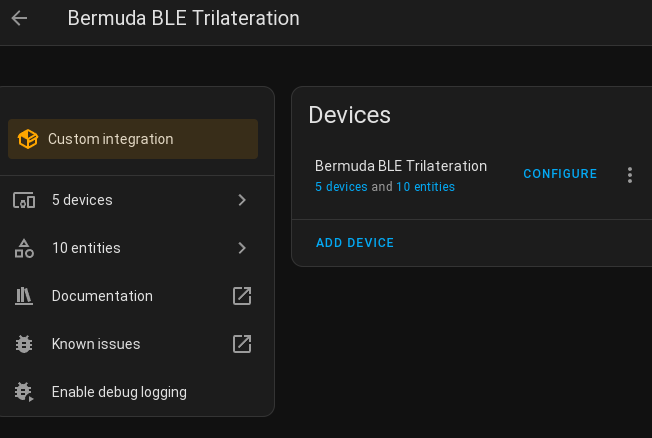
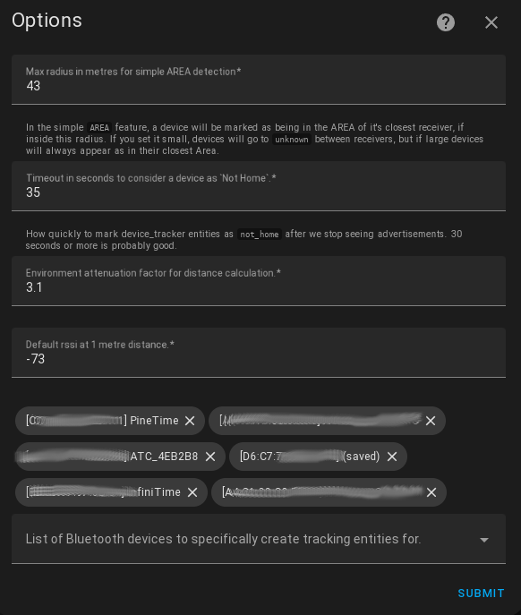
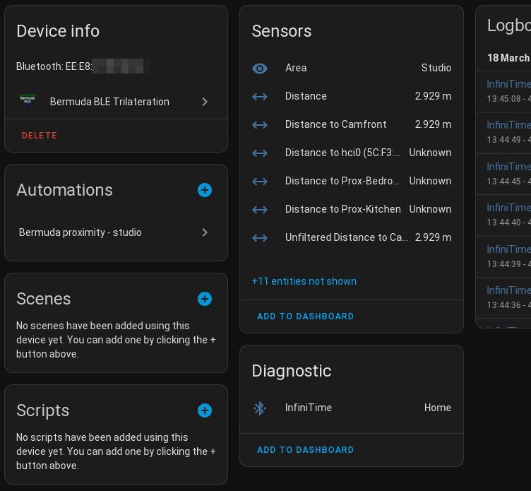
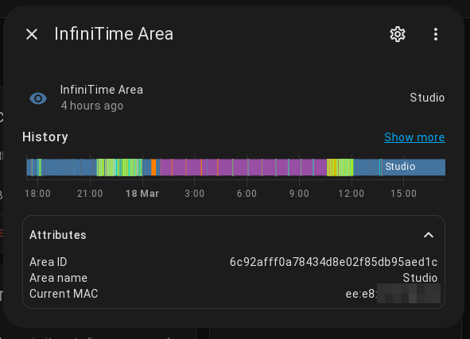
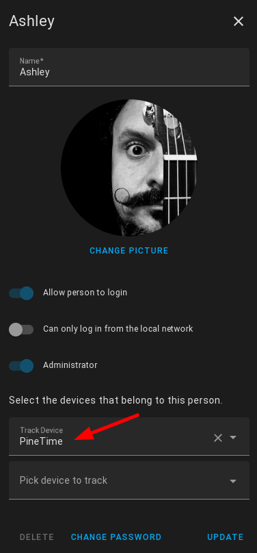

[](https://my.home-assistant.io/redirect/hacs_repository/?owner=foXaCe&repository=bermuda&category=Integration)

# Bermuda BLE Trilateration

- Track bluetooth devices by Area (Room) in [Home Assistant](https://home-assistant.io/), using [ESPHome](https://esphome.io/) [Bluetooth Proxies](https://esphome.io/components/bluetooth_proxy.html) and Shelly Gen2 or later devices.

- (eventually) Triangulate device positions! Like, on a map. Maybe.


[![GitHub Release][releases-shield]][releases]
[![GitHub Activity][commits-shield]][commits]
[![License][license-shield]](LICENSE)
[![HomeAssistant Minimum Version][haminverbadge]][haminver]
[![pre-commit][pre-commit-shield]][pre-commit]
[![Black][black-shield]][black]
[![hacs][hacsbadge]][hacs]
[![Project Maintenance][maintenance-shield]][user_profile]
[![Discord][discord-shield]][discord]
[![Community Forum][forum-shield]][forum]

[![GitHub Sponsors][sponsorsbadge]][sponsors]


## What it does:

Bermuda aims to let you track any bluetooth device, and have Home Assistant tell you where in your house that device is. The only extra hardware you need are esp32 devices running esphome that act as bluetooth proxies. Alternatively, Shelly Plus devices can also perform this function.

- Area-based device location (ie, device-level room prescence) is working reasonably well.
- Creates sensors for Area and Distance for devices you choose
- Supports iBeacon devices, including those with randomised MAC addresses (like Android phones running HA Companion App)
- Supports IRK (resolvable keys) via the [Private BLE Device](https://www.home-assistant.io/integrations/private_ble_device/) core component. Once your iOS device (or Android!) is set up in Private BLE Device, it will automatically receive Bermuda sensors as well!
- Creates `device_tracker` entities for chosen devices, which can be linked to "Person"s for Home/Not Home tracking
- Configurable settings for rssi reference level, environmental attenuation, max tracking radius
- Provides a comprehensive json/yaml dump of devices and their distances from each bluetooth
  receiver, via the `bermuda.dump_devices` service.

## Micro-locations (sub-area spots)

Areas in Home Assistant are as fine-grained as one-per-scanner: a device is placed in the
Area of whichever proxy is closest. **Micro-locations** let you go finer, by naming specific
spots and calibrating them by example. Tell Bermuda *"my keys are on the key hook"* and it
snapshots the RF fingerprint (the pattern of distances across all your proxies) and remembers
that spot, tied to that item. Later it reports `Key hook` vs `Sidetable drawer` as a
**Micro-location** sensor and as an attribute on the Area sensor.

It's designed to be driven without the configuration menu, so MCP clients, the voice
assistant, and automations can all use it:

- **Services:** `bermuda.calibrate_location`, `bermuda.where_is`, `bermuda.list_locations`,
  `bermuda.remove_location`, `bermuda.rename_location`. The existing configuration knobs are
  exposed as services too (`bermuda.track_device`, `bermuda.untrack_device`,
  `bermuda.set_global_calibration`, `bermuda.set_scanner_offset`, `bermuda.get_config`), so a
  bluetooth device can be set up and calibrated entirely from an MCP client or automation.
- **Voice/Assist intents:** `BermudaCalibrateLocation`, `BermudaWhereIs`, `BermudaListLocations`
  (e.g. "where are my keys?", "remember the keys are on the key hook").

How well it can tell two nearby spots apart depends on your setup: it works best for
**stationary items** (keys, remotes, tags) with **several proxies** in range from different
vantage points. "Key hook vs kitchen counter" is very doable; "drawer vs the nightstand right
above it" is at the edge of what BLE can resolve. Moving furniture or proxies will need a quick
recalibration. None of this changes the existing Area logic — it's purely additive.

_(Micro-locations and the MCP service/intent API were ported from
[belikh/bermuda2](https://github.com/belikh/bermuda2).)_

## What you need:

- Home Assistant. The current release of Bermuda requires at least ![haminverbadge]
- One or more devices providing bluetooth proxy information to HA using HA's bluetooth backend. These can be:
  - ESPHome devices with the `bluetooth_proxy` component enabled. I like the D1-Mini32 boards because they're cheap and easy to deploy.
  - Shelly Plus or later devices with Bluetooth proxying enabled in the Shelly integration.
  - USB Bluetooth on your HA host. This is not ideal, since they do not timestamp the advertisement packets and finding a well-supported usb bluetooth adaptor is non-trivial. However they can be used for simple "Home/Not Home" tracking, and basic Area distance support is enabled currently.

- Some bluetooth BLE devices you want to track. Phones, smart watches, beacon tiles, thermometers etc.

- Bermuda! I strongly recommend installing Bermuda via HACS:
  [](https://my.home-assistant.io/redirect/hacs_repository/?owner=foXaCe&repository=bermuda&category=Integration)

## Documentation and help

[The Wiki](https://github.com/foXaCe/bermuda/wiki/) is the primary and official source of information for setting up Bermuda.

[Discussions](https://github.com/foXaCe/bermuda/discussions/) contain both official and user-contributed guides, how-tos and general Q&A.

[HA Community Thread for Bermuda](https://community.home-assistant.io/t/bermuda-bluetooth-ble-room-presence-and-tracking-custom-integration/625780/1) contains a *wealth* of information from and for users of Bermuda, and is where many folk first ask for assistance in setting up.

## Screenshots

After installing, the integration should be visible in Settings, Devices & Services



Press the `CONFIGURE` button to see the configuration dialog. At the bottom is a field
where you can enter/list any bluetooth devices the system can see. Choosing devices
will add them to the configured devices list and creating sensor entities for them. See [How Do The Settings Work?](#how-do-the-settings-work) for more info.



Choosing the device screen shows the current sensors and other info. Note that there are extra sensors in the "not shown" section that are disabled by default (the screenshot shows several of these enabled already). You can edit the properties of these to enable them for more detailed data on your device locations. This is primarily intended for troubleshooting or development, though.



The sensor information also includes attributes area name and id, relevant MAC addresses
etc.



In Settings, People, you can define any Bermuda device to track home/away status
for any person/user.



## Supported devices

**Anything that advertises Bluetooth Low Energy can be tracked**, including:

- **Plain BLE devices** (fixed MAC): beacon tiles, thermometers, watches, headphones…
- **iBeacons**, including senders with randomised MACs (e.g. Android phones running the
  HA Companion App). Bermuda tracks the iBeacon identity (`uuid_major_minor`), not the MAC.
- **Private BLE devices** (iPhone/iPad/Watch, IRK-based): via the core
  [Private BLE Device](https://www.home-assistant.io/integrations/private_ble_device/)
  integration; enrol directly from Bermuda's options menu or the `bermuda.enrol_private_device` action.
- **Item trackers recognised by advert signature**: AirTag, AirPods, Samsung SmartTag,
  Tile, TrackR, Nut, Google Find My Device network tags — labelled in the discovery pickers.
- **InPlay IN100 / DFRobot Fermion beacons**: their `0x0505` telemetry (supply voltage,
  temperature, ADC voltage) is decoded into dedicated sensors automatically.
- **Whole categories** (ESPresense-style): track every `apple`, `ibeacon`, `irk`, `named`… device at once.

**As receivers (scanners)**: ESPHome `bluetooth_proxy` nodes, Shelly Plus (Gen2+) proxies,
or a local USB Bluetooth adaptor (best-effort: USB adaptors don't timestamp adverts).

## Entities provided

Per tracked device: a `device_tracker` (home/not_home; on HA ≥ 2026.6 it can be associated
with any zone and reports `in_zones`), an **Area** sensor, **Floor**, **Nearest scanner**,
**Micro-location**, **Distance** and **RSSI** sensors, per-scanner **Distance to <scanner>**
(+ unfiltered variant) sensors, an **Area last seen** sensor, a diagnostic
**Area switch reason** sensor (disabled by default), a **Reference power** number and a
**Mobility mode** select (moving/stationary, tunes the smoothing). IN100 beacons also get
voltage/temperature/ADC sensors. A **Bermuda Global** service device carries fleet-wide
counters (proxies, active proxies, devices, visible devices, nearby-devices list).

## How data updates work

Bermuda is a **calculated, 100 % local** integration: it makes no network requests and has
no external dependencies. Home Assistant's Bluetooth stack pushes advertisements from all
your proxies as they arrive; Bermuda also runs a light processing cycle (about once per
second) that smooths RSSI, converts it to distance estimates, arbitrates the winning Area
per device, and prunes stale devices. Sensor updates are rate-limited (`update_interval`
option) to reduce recorder churn without sacrificing latency — a closing distance always
updates immediately.

## Configuration options

The initial setup has **no parameters** (single instance, just confirm). Everything is
tuned afterwards via **Configure**:

| Option | Default | What it does |
|---|---|---|
| `configured_devices` | — | Individual devices to track (the *Scan* step lists nearby, not-yet-tracked devices, strongest first). |
| `track_categories` | — | Track whole categories (ESPresense-style fingerprints) instead of/alongside individual devices. |
| `exclude_devices` | — | Denylist that always wins over category tracking. |
| `ref_power` | −55 dBm | Expected RSSI at 1 m; the global distance calibration. |
| `attenuation` | 3 | Environmental path-loss factor. |
| `max_area_radius` | 20 m | Beyond this distance a scanner can't claim the device for its Area. |
| `devtracker_nothome_timeout` | 30 s | How long unseen before the device_tracker flips to not_home. |
| `update_interval` | 10 s | Sensor rate-limit interval (internal processing stays ~1 s). |
| `smoothing_samples` | 20 | Window of the distance-smoothing average. |
| `max_velocity` | 3 m/s | Readings implying faster retreat are rejected as noise. |
| Area presence entities | — | Motion/contact/etc. entities whose Area, while *on*, competes with BLE at a per-entity "virtual distance". |

Per-scanner **RSSI offset calibration** and per-device **enrolment** (name, ref_power,
away-timeout) are managed as config **subentries** on the integration page.

## Actions (services)

| Action | Purpose |
|---|---|
| `bermuda.dump_devices` | Full JSON dump of internal state (optionally filtered by `addresses`, optionally `redact`ed). |
| `bermuda.enrol_private_device` | Hand an IRK to the Private BLE Device integration so Bermuda tracks an iPhone/Watch. |
| `bermuda.calibrate_location` / `where_is` / `list_locations` / `remove_location` / `rename_location` | Manage micro-locations (also exposed as Assist intents). |
| `bermuda.track_device` / `untrack_device` | Add/remove a tracked device without opening the UI. |
| `bermuda.set_global_calibration` / `set_scanner_offset` / `get_config` | MCP-friendly configuration API. |

## Use cases

- **Room-level presence**: drive lights/climate per room from *which Area a person's watch
  or phone is in*, not just home/away.
- **Find my keys**: put a tag on the keys, calibrate micro-locations ("key hook",
  "jacket pocket"), then ask Assist *"where are my keys?"*.
- **Leaving-home guard**: notify if the backpack's tag is still in the Bedroom when the
  front door opens.
- **Presence-hardened automations**: combine BLE with motion sensors via the area-entity
  override so a triggered motion sensor can win the Area for stationary devices.

## Example automations

Turn on the office lights when your watch enters the Office:

```yaml
automation:
  - alias: "Office lights follow my watch"
    triggers:
      - trigger: state
        entity_id: sensor.my_watch_area   # Bermuda Area sensor
        to: "Office"
    actions:
      - action: light.turn_on
        target:
          area_id: office
```

Warn when leaving without the keys:

```yaml
automation:
  - alias: "Forgot the keys"
    triggers:
      - trigger: state
        entity_id: binary_sensor.front_door
        to: "on"
    conditions:
      - condition: state
        entity_id: device_tracker.keys_tag
        state: "home"
    actions:
      - action: notify.mobile_app_phone
        data:
          message: "Door opened but the keys are still {{ states('sensor.keys_tag_area') }}!"
```

## Known limitations

- **BLE distance is an estimate.** RSSI varies with walls, bodies and antenna orientation;
  expect metre-scale accuracy at best. Bermuda optimises *which room*, not coordinates —
  there is no x/y map positioning (yet).
- **Area changes are damped on purpose.** The mobility-aware hysteresis trades a few
  seconds of latency for stability; a device sitting between two rooms may legitimately
  read as either.
- **Proxies need an Area.** Devices seen only by area-less proxies can't be placed
  (a repair issue guides you through fixing this).
- **USB adaptors are second-class**: no advert timestamps, so distances are coarser.
- **Randomised MACs without IRK/iBeacon identity can't be tracked long-term** (they rotate);
  use Private BLE Device (IRK) or an iBeacon-capable app instead.
- **Assist intent replies are English-only** (custom intents have no HA translation
  mechanism; voice assistants and MCP clients typically rephrase in your language).

## Troubleshooting

- **"No scanners" in the options menu status**: no Bluetooth proxies are feeding HA. Check
  your ESPHome `bluetooth_proxy`/Shelly configuration; the scanner table in that same menu
  shows each proxy's last-advert age (✔ fresh / ⚠ slow / ☠ silent).
- **Repair: "Some Bluetooth Proxies don't have an AREA"**: assign an Area on each proxy's
  device page, then press *Submit* on the repair — Bermuda re-checks immediately.
- **Distances look wrong**: calibrate `ref_power` globally (device at exactly 1 m from a
  proxy), then per-scanner RSSI offsets via the calibration subentries.
- **Device flip-flops between rooms**: set its **Mobility mode** select to *stationary*
  (steadier smoothing), add/move a proxy, or lower `max_area_radius`.
- **Everything is "unavailable" after HA 2026.6**: the Bluetooth *Auto* scanning mode cut
  radio duty-cycles; if a proxy went quiet, check it still appears in the scanner table.
- **Deep diagnosis**: call `bermuda.dump_devices` (with `redact: true` when sharing) and
  attach it to your issue, plus the integration's Diagnostics download.

## FAQ

See [The FAQ](https://github.com/foXaCe/bermuda/wiki/FAQ) in the Wiki!

## Hacking tips

Wanna improve this? Awesome! Bear in mind this is my first ever HA
integration, and I'm much more greybeard sysadmin than programmer, so ~~if~~where
I'm doing stupid things I really would welcome some improvements!

You can start by using the service `bermuda.dump_devices` to examine the
internal state.

### Using `bermuda.dump_devices` service

Just calling the service `bermuda.dump_devices` will give you a full dump of the internal
data structures that bermuda uses to track and calculate its state. This can be helpful
for working out what's going on and troubleshooting, or to use if you have a very custom
need that you can solve with template sensors etc.

If called with no parameters, the service will return all data. parameters are available
which let you limit or reformat the resulting data to make it easier to work with. In particular
the `addresses` parameter is helpful to only return data relevant for one or more MAC addresses
(or iBeacon UUIDs).
See the information on parameters in the `Services` page in Home Assistant, under `Developer Tools`.

Important: If you decide to use the results of this call for your own templates etc, bear in mind that
the format might change in any release, and won't necessarily be considered a "breaking change".
This is because the structure is used internally, rather than being a published API. That said, efforts will be made
to indicate in the release notes if fields in the structure are renamed or moved, but not for adding new
items.

## Prior Art

The `bluetooth_tracker` and `ble_tracker` integrations are only built to give a "home/not home"
determination, and don't do "Area" based location. (nb: "Zones" are places outside the
home, while "Areas" are rooms/areas inside the home). I wanted to be free to experiment with
this in ways that might not suit core, but hopefully at least some of this could find
a home in the core codebase one day.

The "monitor" script uses standalone Pi's to gather bluetooth data and then pumps it into
MQTT. It doesn't use the `bluetooth_proxy` capabilities which I feel are the future of
home bluetooth networking (well, it is for my home, anyway!).

ESPresense looks cool, but I don't want to dedicate my nodes to non-esphome use, and again
it doesn't leverage the bluetooth proxy features now in HA. I am probably reinventing
a fair amount of ESPresense's wheel.

## Installation

You can install Bermuda by opening HACS on your Home Assistant instance and searching for "Bermuda".
Alternatively you can click the button below to be automatically redirected.

[](https://my.home-assistant.io/redirect/hacs_repository/?owner=foXaCe&repository=bermuda&category=Integration)

You should now be able to add the `Bermuda BLE Trilateration` integration. Once you have done that,
you need to restart Home Assistant, then in `Settings`, `Devices & Services` choose `Add Integration`
and search for `Bermuda BLE Trilateration`. It's possible that it will autodetect for you just by
noticing nearby bluetooth devices.

Once the integration is added, you need to set up your devices by clicking `Configure` in `Devices and Services`,
`Bermuda BLE Trilateration`.

In the `Configuration` dialog, you can choose which bluetooth devices you would like the integration to track.

You can manually install Bermuda by doing the following:

1. Using the tool of choice open the directory (folder) for your HA configuration (where you find `configuration.yaml`).
2. If you do not have a `custom_components` directory (folder) there, you need to create it.
3. In the `custom_components` directory (folder) create a new folder called `bermuda`.
4. Download _all_ the files from the `custom_components/bermuda/` directory (folder) in this repository.
5. Place the files you downloaded in the new directory (folder) you created.
6. Restart Home Assistant
7. In the HA UI go to "Configuration" -> "Integrations" click "+" and search for "Bermuda BLE Trilateration"

## Removal

To remove the Bermuda integration:

1. In Home Assistant, go to **Settings** → **Devices & Services**
2. Find **Bermuda BLE Trilateration** and click on it
3. Click the three-dot menu (⋮) and select **Delete**
4. Restart Home Assistant

If you installed via HACS, you can also uninstall it from the HACS interface after removing the integration.

<!---->

## Contributions are welcome!

If you want to contribute to this please read the [Contribution guidelines](CONTRIBUTING.md)

## Credits

This project was generated from [@oncleben31](https://github.com/oncleben31)'s [Home Assistant Custom Component Cookiecutter](https://github.com/oncleben31/cookiecutter-homeassistant-custom-component) template.

Code template was mainly taken from [@Ludeeus](https://github.com/ludeeus)'s [integration_blueprint][integration_blueprint] template
[Cookiecutter User Guide](https://cookiecutter-homeassistant-custom-component.readthedocs.io/en/stable/quickstart.html)\*\*

---

[integration_blueprint]: https://github.com/custom-components/integration_blueprint

[black]: https://github.com/psf/black
[black-shield]: https://img.shields.io/badge/code%20style-black-000000.svg?style=for-the-badge


[commits-shield]: https://img.shields.io/github/commit-activity/y/foXaCe/bermuda.svg?style=for-the-badge
[commits]: https://github.com/foXaCe/bermuda/commits/main

[hacs]: https://hacs.xyz
[hacsbadge]: https://img.shields.io/badge/HACS-Default-green.svg?style=for-the-badge

[haminver]: https://github.com/foXaCe/bermuda/commits/main/hacs.json
[haminverbadge]: https://img.shields.io/badge/dynamic/json?url=https%3A%2F%2Fgithub.com%2FfoXaCe%2Fbermuda%2Fraw%2Fmain%2Fhacs.json&query=%24.homeassistant&style=for-the-badge&logo=homeassistant&logoColor=%2311BDF2&label=Minimum%20HA%20Version

[discord]: https://discord.gg/Qa5fW2R
[discord-shield]: https://img.shields.io/discord/330944238910963714.svg?style=for-the-badge

[exampleimg]: example.png
[forum-shield]: https://img.shields.io/badge/community-forum-brightgreen.svg?style=for-the-badge
[forum]: https://community.home-assistant.io/

[license-shield]: https://img.shields.io/github/license/foXaCe/bermuda.svg?style=for-the-badge
[maintenance-shield]: https://img.shields.io/badge/maintainer-%40foXaCe-blue.svg?style=for-the-badge


[pre-commit]: https://github.com/pre-commit/pre-commit
[pre-commit-shield]: https://img.shields.io/badge/pre--commit-enabled-brightgreen?style=for-the-badge

[sponsorsbadge]: https://img.shields.io/github/sponsors/foXaCe?style=for-the-badge&label=GitHub%20Sponsors&color=green
[sponsors]: https://github.com/sponsors/foXaCe

[releases-shield]: https://img.shields.io/github/release/foXaCe/bermuda.svg?style=for-the-badge
[releases]: https://github.com/foXaCe/bermuda/releases
[user_profile]: https://github.com/foXaCe
